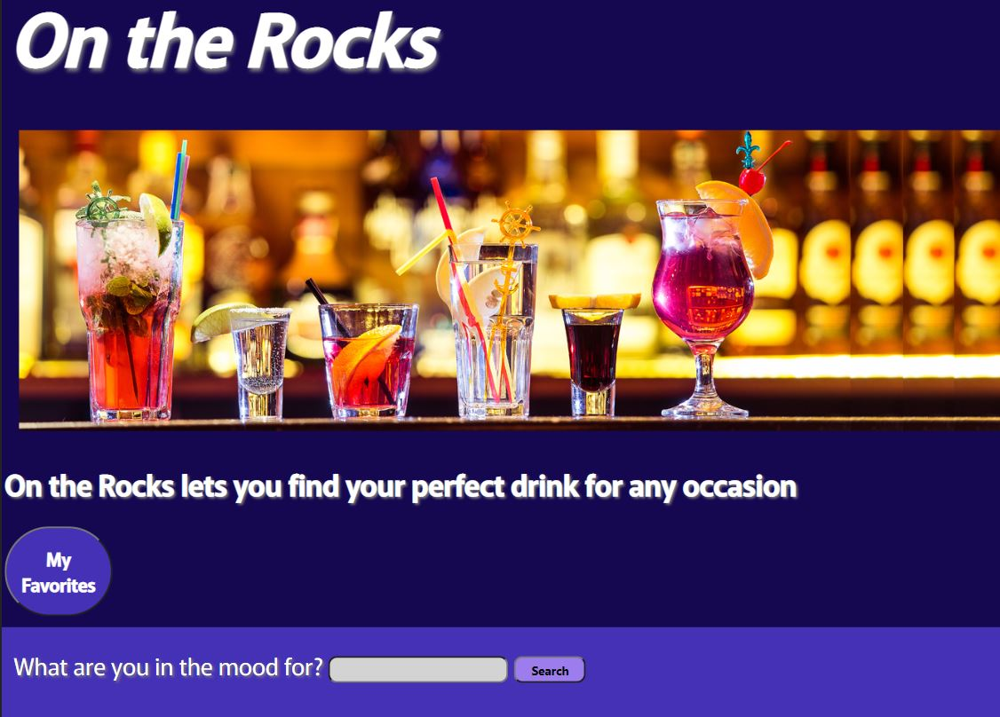

# ontherocks

## Desciption
This goal of this project was to create a website that is easy to navigate and user friendly, that allows the user to search for a drink with it's ingredients by category of liquor, name of ingredient, or alphabetically. When the user clicks on the drink of their choice, a modal pops up with information about the drink and how to make it and a picture. Also, there is an "Ice Breaker" button that serves as a conversation starter. A user can click the button and a randomly generated conversation topic is displayed. 

## Table of Contents
- [Installation](#installation) -- No install necessary
- [Usage](#Usage) -- Open in browser
- [URL](https://blickenderfer.github.io/ontherocks/)
- [Screenshots](#screenshot) -- See below
- [Credits](#Credits) -- Emma Claire Blickenderfer, Amanda Whitley, Joseph Pham, Amir Jones
- [License](#license) MIT license

## Installation
No install necessary

## Usage
Open in Browser. 

## URL
https://blickenderfer.github.io/ontherocks/

## Screenshot

![screenshot]

## Credits
Emma Claire Blickenderfer, Amanda Whitley, Joseph Pham, Amir Jones

## License
MIT license

Copyright (c) 2023 "Emma Claire Blickenderfer, Amanda Whitley, Joseph Pham, Amir Jones"

Permission is hereby granted, free of charge, to any person obtaining a copy of this software and associated documentation files (the "Software"), to deal in the Software without restriction, including without limitation the rights to use, copy, modify, merge, publish, distribute, sublicense, and/or sell copies of the Software, and to permit persons to whom the Software is furnished to do so, subject to the following conditions:

The above copyright notice and this permission notice shall be included in all copies or substantial portions of the Software.

THE SOFTWARE IS PROVIDED "AS IS", WITHOUT WARRANTY OF ANY KIND, EXPRESS OR IMPLIED, INCLUDING BUT NOT LIMITED TO THE WARRANTIES OF MERCHANTABILITY, FITNESS FOR A PARTICULAR PURPOSE AND NONINFRINGEMENT. IN NO EVENT SHALL THE AUTHORS OR COPYRIGHT HOLDERS BE LIABLE FOR ANY CLAIM, DAMAGES OR OTHER LIABILITY, WHETHER IN AN ACTION OF CONTRACT, TORT OR OTHERWISE, ARISING FROM, OUT OF OR IN CONNECTION WITH THE SOFTWARE OR THE USE OR OTHER DEALINGS IN THE SOFTWARE.

## Badges
N/A

## Features
N/A

## Tests
Tested during milestones